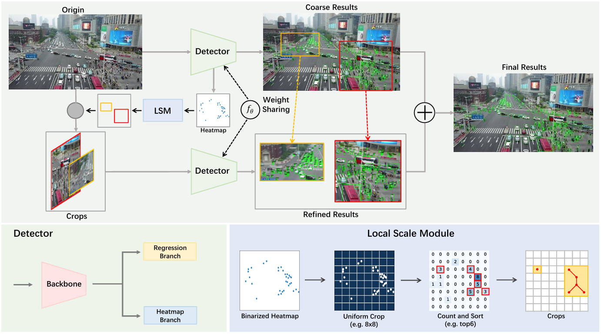

# 工作记录

**目标**：修改YOLC中关于整张图片的回归部分

看到Detector对于`Coarse Results`与`Refined Results`同时做了处理, 我们希望去除对于`Coarse Results`的一支

## 代码分析
### `inference_YOLC.py`
是YOLC推理图像调用的代码, 有
 - inference_detector
 - inference_detector_with_LSM

两个函数,最大区别在于是否是crop=True(LSM中crop=true)
```python
def inference_detector(model, imgs):
    ...
    with torch.no_grad():
        results = model(return_loss=False, rescale=True, **data)
    if not is_batch:
        return results[0]
    else:
        return results


def inference_detector_with_LSM(model, imgs):
    ...
    with torch.no_grad():
        cluster_region, results = model(return_loss=False, rescale=True, crop=True, **data)
    if not is_batch:
        return cluster_region, results[0]
    else:
        return cluster_region, results
```

### `model`
发现了这个最大的不同点之后回到model的结构中去找哪里有crop=True/False的区别,于是到models/dense_heads/yolc_head.py中去查找crop这个参数的意义, 最终定位到`simple_test`这个函数上:
```python
def simple_test(self, feats, img_metas, rescale=False, crop=False):   
    if crop:
        return self.simple_test_bboxes(feats, img_metas, rescale=rescale, crop=True)
    else:
        return self.simple_test_bboxes(feats, img_metas, rescale=rescale)
```
而它所调用的`simple_test_bboxes`:
```python
def simple_test_bboxes(self, feats, img_metas, rescale=False, crop=False):
    outs = self.forward(feats)
    results_list = self.get_bboxes(*outs, img_metas, rescale=rescale)
    if crop:
        return self.LSM(outs[0], img_metas), results_list
    else:
        return results_list
```
可以看到在crop=True的时候会调用一个LSM方法,去将outs与img_metas做LSM, 而crop=Flase的时候不会这么处理

恰恰对应了图片中的对heatmap做LSM这一支

